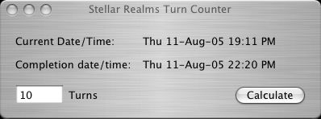

# StellarRealms

Stellar Realms was an online, multiplayer strategy game in a science-fiction setting. The object was to accumulate as much prestige as possible, through various means, in the period of 400 game-years.

This could be accomplished through construction, research, diplomacy, and occasionally, military action. One month in the Stellar Realms universe constitutes a turn, and represents 20 minutes of "real-world" time. Therefore, a full 400-year round is accomplished in 66 real-world days.

This repo contains several GreaseMonkey scripts and websites I wrote to support some friends with the game. The result was that our secret (cabal) was able to manipulate other factions and win almost every round or at least get all members of our cabal faction in the top 10.

# Overview

## Stellar Relams Turn Counter (SRTC)
The tool that started it all in 2005.  
Stellar Realms is based on turns, one represents 20 minutes. This tool will help plan research, intelligence, attacks, etc because it calculates the completion time.

 

